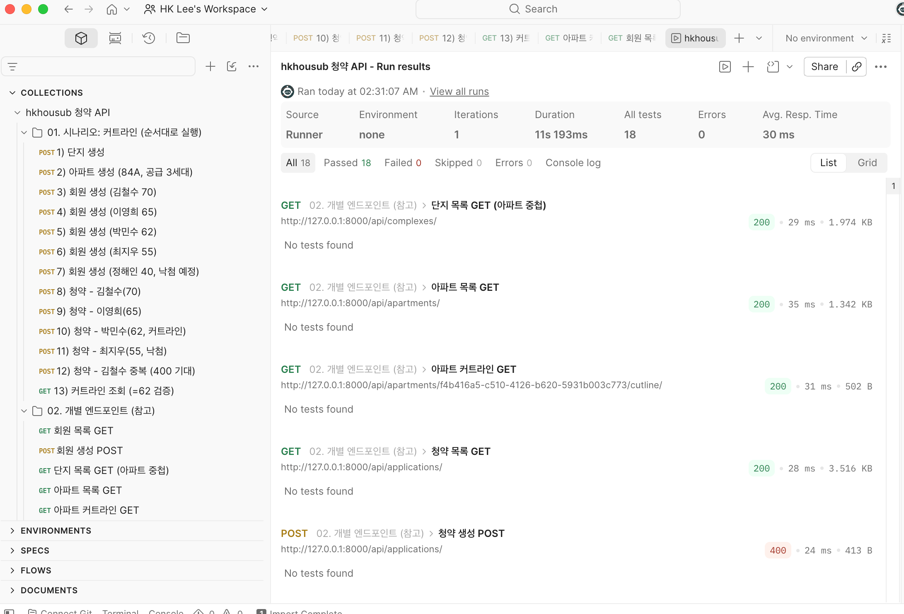

# hkhousub — 아파트 청약 서비스 (MVP)

Django REST Framework로 만든 아파트 **청약(subscription)** 관리 REST API.
회원이 아파트에 청약하면 **공급 세대수**와 **청약가점**을 바탕으로 **커트라인(당첨 최저 가점)** 과 **경쟁률**을 계산해 조회한다.

> 도메인 구조는 사실상 커머스의 **User / Product(+Company) / Order** 와 동형이며,
> "재고 한정 상품에 가점 랭킹으로 낙찰"되는 특수 주문 모델이다.

---

## 기술 스택

| 항목 | 사용 기술 |
|---|---|
| Language / Runtime | Python 3.14 |
| Framework | Django 6 + Django REST Framework |
| Database | PostgreSQL 16 (Docker) |
| DB Driver | psycopg 3 |
| PK 전략 | UUID (`uuid4`) |
| 마이그레이션 | Django Migrations |
| API 테스트 | Postman / newman |

---

## 도메인 모델 (ERD)

```
Complex(단지) 1 ──< N Apartment(아파트) 1 ──< N Application(청약) N >── 1 Member(회원)
```

| 모델 | 앱 | 핵심 필드 | 커머스 대응 |
|---|---|---|---|
| `Complex` 단지 | `apartments` | name, region | Company |
| `Apartment` 아파트 | `apartments` | complex(FK), **supply_count(공급세대수)**, area, price | Product (재고) |
| `Member` 회원 | `members` | name, **score(청약가점 0~84)** | User |
| `Application` 청약 | `applications` | apartment(FK), member(FK), score(스냅샷) | Order |

- 공통 `BaseModel`(UUID PK + created_at)은 `common` 앱에 두고 모든 모델이 상속.
- `(apartment, member)` 유니크 제약 → 중복 청약 불가.

전체 명세는 [`specification.md`](./specification.md) 참고.

---

## 프로젝트 구조

```
config/          # 프로젝트 설정 (settings, urls)
common/          # BaseModel(UUID) + seed 커맨드
members/         # 회원      (= User)
apartments/      # 단지·아파트 (= Company, Product)
applications/    # 청약      (= Order)
docker-compose.yml
```

각 앱은 flat 구조(`models / serializers / services / views / urls`).
비즈니스 로직은 `services.py`(스프링 `@Service`)에 분리.

---

## 커트라인 계산 로직

공급 세대수를 `N`, 청약 수를 `C`라 할 때:

1. 청약을 **가점 내림차순**(동점이면 먼저 청약한 순)으로 정렬
2. `C ≥ N` → **커트라인 = N등의 가점**, 상태 `마감`
3. `C < N` → 커트라인 없음, 상태 `미달`
4. **경쟁률 = C / N**

파생 데이터라 DB에 저장하지 않고 조회 시점에 계산한다. (`apartments/services.py`)

---

## API

Base URL: `/api/`

| Method | Endpoint | 설명 |
|---|---|---|
| GET/POST | `/api/complexes/` | 단지 목록 / 등록 |
| GET/POST | `/api/apartments/` | 아파트 목록 / 등록 |
| GET | **`/api/apartments/{id}/cutline/`** | **커트라인 조회** |
| GET/POST | `/api/members/` | 회원 목록 / 등록 |
| GET/POST | **`/api/applications/`** | 청약 목록 / **청약하기** |

**커트라인 응답 예시**
```json
{
  "apartment_name": "84A",
  "supply_count": 3,
  "application_count": 4,
  "competition_rate": 1.33,
  "status": "마감",
  "cutline_score": 62
}
```

---

## 실행 방법

```bash
# 1) 가상환경 + 의존성
python -m venv .venv && source .venv/bin/activate
pip install django djangorestframework "psycopg[binary]"

# 2) DB (도커)
docker compose up -d

# 3) 마이그레이션 + 샘플 데이터
python manage.py migrate
python manage.py seed          # 단지 1, 아파트 2, 회원 5명 생성

# 4) 서버 실행
python manage.py runserver     # http://127.0.0.1:8000
```

관리자 화면: `python manage.py createsuperuser` 후 http://127.0.0.1:8000/admin

---

## 성능 — N+1 쿼리 해결

`GET /api/complexes/` 는 단지마다 소속 아파트를 중첩 직렬화하면서
단지 수만큼 추가 쿼리가 발생하는 **N+1 문제**가 있었다 (단지 4개 → 5쿼리).

`ComplexViewSet` 조회에 **`prefetch_related("apartments")`** 를 적용해
아파트를 IN 쿼리 한 번으로 미리 로딩 → **쿼리 5 → 2, 단지 수와 무관한 상수**로 개선.

> JPA 대응: `select_related` ≈ `JOIN FETCH`(to-one), `prefetch_related` ≈ `@BatchSize`(to-many).

---

## API 테스트 (Postman / newman)

[`postman/hkhousub.postman_collection.json`](./postman/hkhousub.postman_collection.json) 을 Postman에 Import.
`01. 시나리오: 커트라인` 폴더를 Collection Runner로 실행하면
단지→아파트→회원→청약→커트라인(=62) 전 과정이 자동 검증된다. (중복 청약 400 포함)

터미널 실행:
```bash
npx newman run postman/hkhousub.postman_collection.json \
  --folder "01. 시나리오: 커트라인 (순서대로 실행)"
```

**실행 결과**


